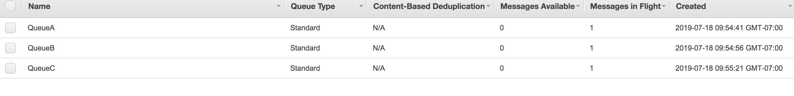

# SQS - Message Queues
Message Queues and Broadcasters and wiring them through code.

## Author
Liz Mahoney

***ScreenShot on AWS console***



## Getting Started

### On AWS Simple Queue Service

Go to your AWS Simple Queue Service console and click the `Get Started Now`button.

On the Create New Queue page:

On `What do you want to name your queue?`

	Enter in a `Queue Name`

On `What type of queue do you need?`

	Select `Standard Queue`

Scroll down and click on `Create Queue` on bottom right side of the page.

### If you receive an access denied

***NOTE:*** When you are getting an access denied on that route, use must configure your AWS credentials on  your machine run `awscli configure` to view your credentials. 

Go to your AWS console and select the appropriate queue.

Under `Permissions` tab, click `add permissions`,  Select checkbox: `Everybody(*)`. then a popup box appears, select the following checkboxes:

- Receive Message
- Delete Message


***Go to AWS IAM*** 

On sidebar, click `Users` add `AmazonSQSFullAccess` permissions

### Create a Java Application

Run command line: `gradle init`, and select a java application 

Once its create, go to `build.gradle` file and update dependencies:

```
dependencies {
    implementation platform('com.amazonaws:aws-java-sdk-bom:1.11.228')
    implementation 'com.amazonaws:aws-java-sdk-sqs'
    testCompile group: 'junit', name: 'junit', version: '4.11'
}
```

***To run application***

` ./gradlew run`

***To test application***

` ./gradlew test`


## Resources

https://github.com/awsdocs/aws-doc-sdk-examples/blob/master/java/example_code/sqs/src/main/java/aws/example/sqs/SendReceiveMessages.java


